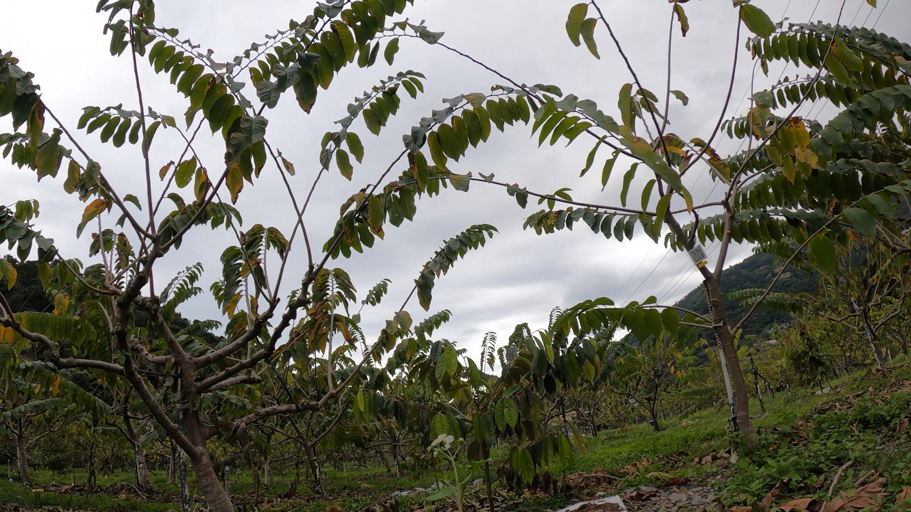
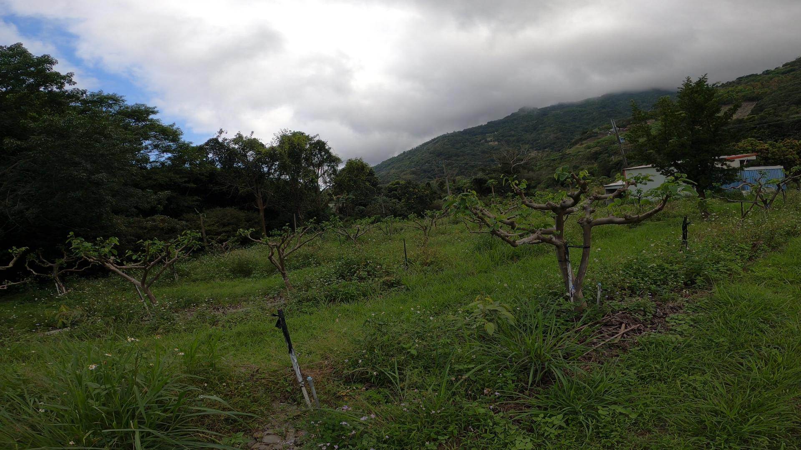
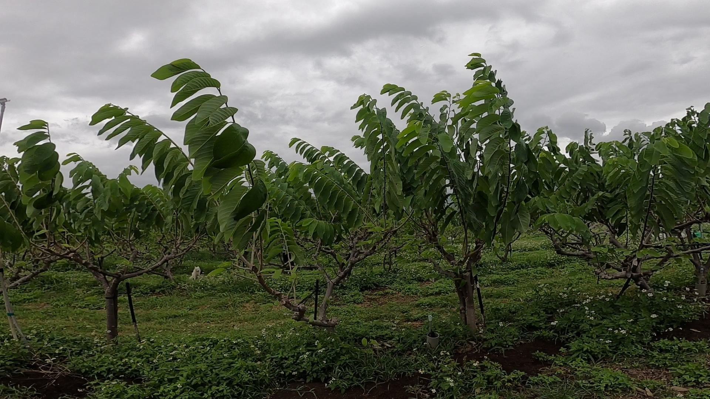
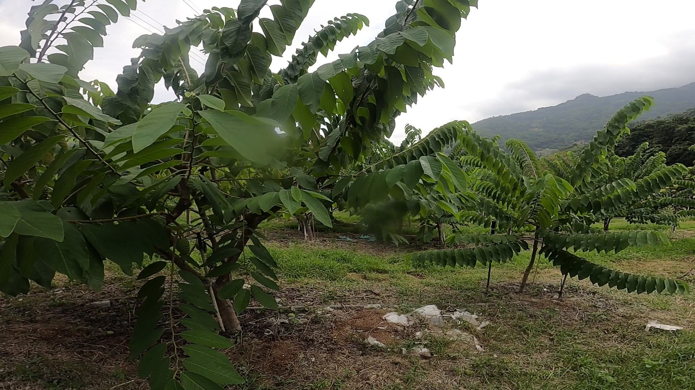
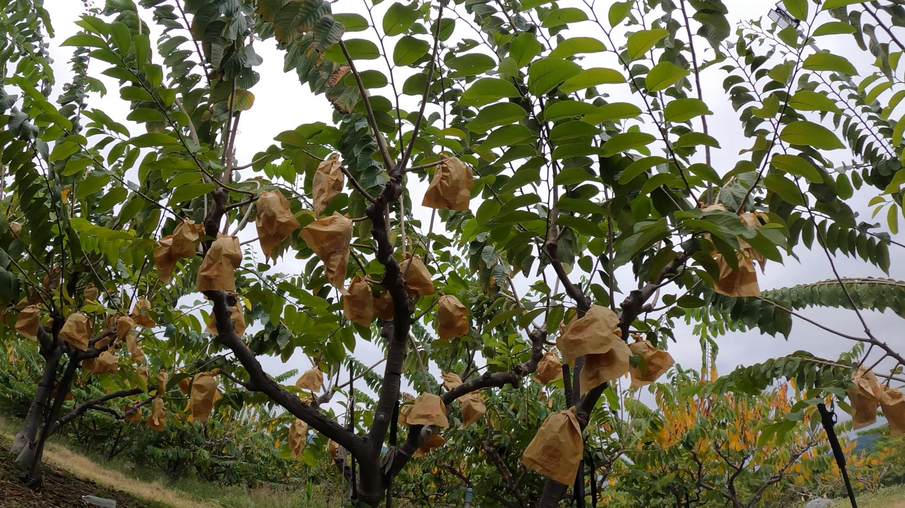

# Taiwan_Agricultural_Research_Institute-project-鳳梨釋迦果樹影像蒐集與偵測辨識


Reference papers - [YOLOv3: An Incremental Improvement](https://arxiv.org/abs/1804.02767)


鳳梨釋迦果樹影像-修枝前


鳳梨釋迦果樹影像-剪枝後



鳳梨釋迦果樹影像-開花授粉期


鳳梨釋迦果樹影像-結實期


鳳梨釋迦果樹影像-套袋期


## Label dataset
利用LabelImg影像標註工具


## Training


## Citation

```
@article{redmon2018yolov3,
  title={Yolov3: An incremental improvement},
  author={Redmon, Joseph and Farhadi, Ali},
  journal={arXiv preprint arXiv:1804.02767},
  year={2018}
}
```
