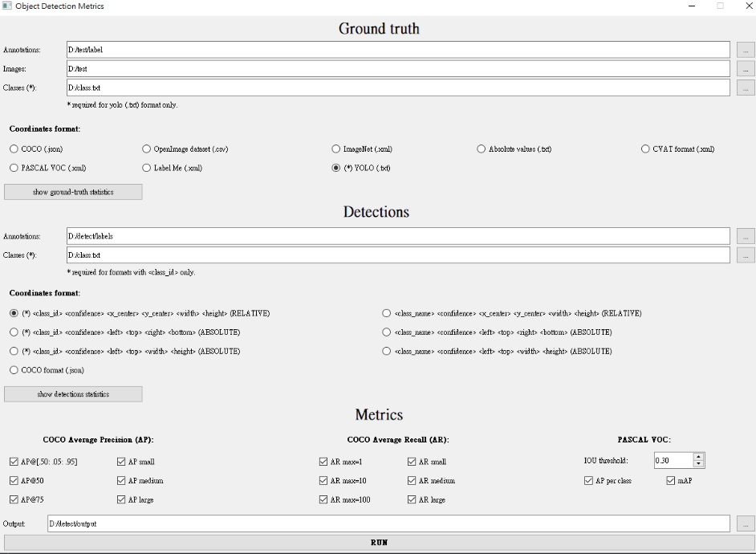
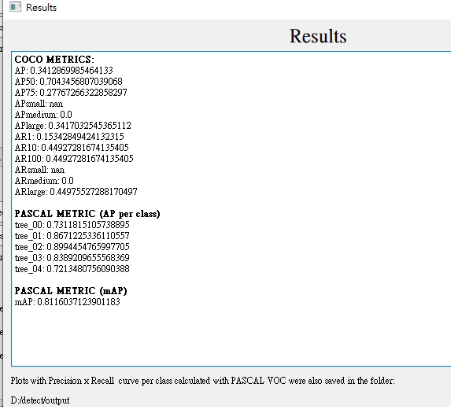
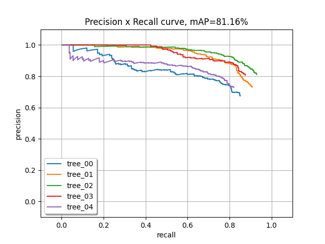

# Taiwan_Agricultural_Research_Institute-project-鳳梨釋迦果樹影像蒐集與偵測辨識


Reference papers - [YOLOv3: An Incremental Improvement](https://arxiv.org/abs/1804.02767)


鳳梨釋迦果樹影像-修枝前


鳳梨釋迦果樹影像-剪枝後


鳳梨釋迦果樹影像-開花授粉期


鳳梨釋迦果樹影像-結實期


鳳梨釋迦果樹影像-套袋期


## Label dataset
利用LabelImg影像標註工具


## Training
創個yaml檔案.data/kitti.yaml，裡面要有訓練集、驗證集、測試集路徑位址，以及打上所有類別例如:第0類修枝期為tree_00、第1類剪枝期為tree_01、第2類開花授粉期為tree_02、第3類結實期為tree_03、第4類套袋期為tree_04


準備.data/project/train.txt(`train.txt`/`val.txt`) 將訓練圖片位址放入，格式如下
```
/home/tony/yolov3-master/atemoya_img/train/01_1.jpg
/home/tony/yolov3-master/atemoya_img/train/01_2.jpg
/home/tony/yolov3-master/atemoya_img/train/01_3.jpg
/home/tony/yolov3-master/atemoya_img/train/01_4.jpg
...
```

run
```
python train.py
```

## Detect
```
python detect.py
```

## Testing
檢測結果跟test原本的Ground truth 進行運算後得到各類AP修枝期為0.731、剪枝期為0.867 、開花授粉期為0.899、結實期為0.839、套袋期為0.721以及整體mAP達到0.8116(81.16%)

[review_object_detection_metrics](https://github.com/rafaelpadilla/review_object_detection_metrics)


<details><summary> <b>Result</b> </summary>




```

</details>


## Citation

```
@article{redmon2018yolov3,
  title={Yolov3: An incremental improvement},
  author={Redmon, Joseph and Farhadi, Ali},
  journal={arXiv preprint arXiv:1804.02767},
  year={2018}
}
```
